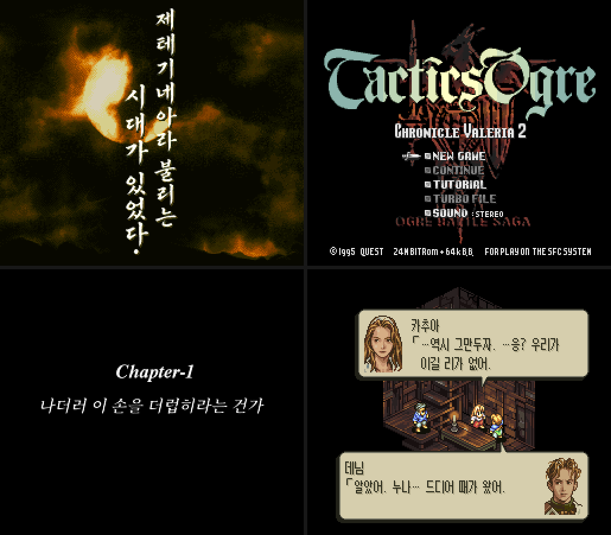

# 택틱스 오우거 CV2 한글 패치 — 베타 2

슈퍼 패미컴 「タクティクスオウガ」(Tactics Ogre, 1995)의 개조판 **「タクティクスオウガ：クロニクル ヴァレリア 2」(Chronicle Valeria 2, CV2) v1.66** 한국어 번역 패치입니다.
**원판(v1.2) 롬에 이 패치 하나만 적용하면 CV2 v1.66 과 한국어 번역이 함께 들어갑니다.**

**베타판**입니다: 번역은 초벌 뒤 독립 검토와 원문 전수 대조 교정을 거쳤지만 사람의 최종 검토가 끝나지 않았고, 처음부터 끝까지 실제로 플레이해 보지는 않았습니다. 어색한 문장이나 오역, 깨지는 화면이 남아 있을 수 있습니다.

> **피드백·버그 제보는 Discord 로**: **https://discord.gg/3qQ3drmwQV** (장소·인물·앞뒤 대사와 스크린샷을 함께 올려 주세요)

비공식 팬 번역입니다. 이 패치에는 게임 롬이 들어 있지 않으며, 원본 게임은 직접 준비해야 합니다.

## 내려받기

[Releases](https://github.com/beck4679-alt/TacticsOgreCV2-KR/releases) 에서 `TacticsOgreCV2_KR_beta2.zip` (패치 + 이 설명 + 글꼴 라이선스)

## 필요한 원본 (원판 v1.2)

| 항목 | 값 |
|---|---|
| 판본 | Tactics Ogre - Let Us Cling Together (Japan) (Rev 2) = v1.2 |
| 크기 | 3,145,728바이트 (헤더 없음) |
| CRC32 | `12F0A699` |
| SHA-1 | `93e975f1e59004ba3da5646c57a721e8ff34b3a0` |
| SHA-256 | `e5f123142d3239da71be8cee1891f92b8074dea8324186562c5ff3144fa76cd3` |

- v1.0·v1.1 롬에는 맞지 않습니다. 헤더(512바이트)가 붙은 `.smc` 파일(3,146,240바이트)은 앞 512바이트를 떼어 낸 뒤 적용하세요.
- **CV2 IPS 를 먼저 적용하지 마세요.** CV2 v1.66 은 이 패치에 들어 있습니다(아래 「CV2 에 대해」).

## 적용 방법

패치 파일 `TacticsOgreCV2_KR_beta2.xdelta`의 형식은 xdelta(VCDIFF)입니다.

- 웹: [Rom Patcher JS](https://www.marcrobledo.com/RomPatcher.js/) 에서 원본 롬과 패치를 고르고 적용
- Windows: xdelta UI · Delta Patcher 에서 원본 롬과 패치를 고르고 적용
- 명령줄: `xdelta3 -d -s 원본.sfc TacticsOgreCV2_KR_beta2.xdelta 택틱스오우거CV2_한글.sfc`

적용 결과 (CV2 와 같은 4MB):

| 항목 | 값 |
|---|---|
| 크기 | 4,194,304바이트 (4MB) |
| CRC32 | `ACA15811` |
| SHA-256 | `96930b5163659e98f25a1ee300d7348c04d55c9f5764c160e6673c2f2e8f950c` |

원본이 다르면(헤더가 붙은 롬, 다른 판, CV2 를 먼저 적용한 롬) 패치 안의 결과 체크섬이 맞지 않아 적용 도구가 멈춥니다.

패치 파일: 1,752,106바이트, SHA-256 `9c42a3af7cca89d857ff05d35687a3d6e0bd1e06a3e37be7e598f32044316e54`

## CV2 에 대해

- CV2 는 KT ◆0T3wqu6irw 님이 2014년에 공개한 개조판입니다. 이야기와 인물은 원작과 거의 같지만 클래스·기술·게임 체계가 크게 바뀌었습니다(0x14 님의 클래스 체인지 확장 패치를 바탕으로 aaaa·heika·755 님의 패치를 썼다고 밝히고 있습니다). 게임 내용의 변경은 모두 CV2 의 것이고, 이 패치는 문장과 화면 글자를 한국어로 옮기고 한글 이름 입력을 더했습니다.
- CV2 의 원래 배포처와 연락처가 닫혀 배포 허락을 받지 못했고 CV2 패치도 구하기 어려워서, 원판에 바로 적용할 수 있도록 CV2 v1.66 의 변경분을 이 패치에 함께 담았습니다. **CV2 제작자분께서 원하시면 바로 내리겠습니다.**
- 이 패치가 바탕으로 삼은 CV2 v1.66 은 원판 v1.2 에 `TO_CV2_v166.ips`(1,500,666바이트, SHA-256 `8b44f3dc3597626074f389477721aa0fc6cab3103e48f4ac19c94b0c9c5c0c0d`)를 적용한 롬(CRC32 `9F554CC4`)입니다.

## 실행 환경

- 확인한 것: BizHawk 2.11.1 (BSNESv115+ 코어)와 조사용 에뮬레이터. 다른 에뮬레이터와 실기는 확인하지 않았습니다.
- CV2 제작자는 Snes9x 로 확인했고, 에뮬레이터의 `BlockInvalidVRAMAccess` 를 꺼야(FALSE) 편성 화면과 오프닝 그래픽이 깨지지 않는다고 적었습니다(Snes9x: 설정 파일 `[Settings]` 의 `BlockInvalidVRAMAccess = FALSE`).
- CV2 는 세이브 메모리(SRAM)를 32KB 로 늘려 게임 중에도 씁니다. 스테이트 세이브를 쓸 때는 SRAM 이 스테이트에 함께 들어가게 설정하세요(대부분의 에뮬레이터는 기본값으로 됩니다).

## 번역한 것

- 대사 전부(이야기·전투·튜토리얼·워렌 리포트·시스템 안내), 단어장(아이템·클래스·기술·지명·인물 등), 메뉴
- CV2 가 더한 문장: 클래스 체인지 조건·확장 도움말·추가 이벤트 대화, 기술 이름, 이동 유형, 아이템 도움말의 성능 줄
- 한글 이름 입력: 초성을 고르면 그 초성으로 시작하는 음절 목록이 나오는 방식 (1,633자)
- 그림으로 된 글자: 인트로 세로 붓글씨(한글 붓글씨로 새로 그림), 장 제목 카드 부제, 전투 전 승리 조건, 월드맵 지명·날짜, 명령 이름, 편성 화면 글자
- 그대로 둔 것: 타이틀 로고와 타이틀 메뉴(NEW GAME 등), 「GAME START」·「LEADER」·「Chapter-N」처럼 원판도 영어인 글자, 오프닝 제작진 이름

## 베타 안내 — 아직 확인이 끝나지 않은 것

- **번역**: 초벌 번역 뒤 독립 검토를 거치고, 마지막에 전체 문장을 원문과 한 줄씩 다시 대조해 고쳤습니다. 사람의 최종 검토는 아직입니다.
- **처음부터 끝까지 실제로 플레이해 보지는 않았습니다.** 오프닝·이름 입력·1장 첫 장면·월드맵·첫 전투·스테이터스·상점 같은 장면 확인과 전체 자동 검사(모든 문장의 줄 폭·줄 수)로 대신했습니다. 진행이 막히는 문제는 찾지 못했지만, 없다고 보장하지는 못합니다.
- 화면으로 아직 확인하지 못한 것: 기사단 이름 입력 장면, 한글로 지은 이름을 저장한 뒤 다시 불러오기, 설정 화면의 단축 기능 표시 언어, 편성·상세 메뉴와 전투 중 안내 창 일부

## 세이브

- 세이브 메모리 크기는 CV2 와 같습니다(32KB).
- 원판 세이브는 CV2 에서 쓸 수 없습니다(CV2 안내). 일본어 CV2 로 만든 세이브는 이름 글자가 깨져 보일 수 있으니 새로 시작하기를 권합니다.

## 오류 제보

오역·오타·어색한 문장·깨지는 화면을 발견하면 [Discord](https://discord.gg/3qQ3drmwQV) 나 [Issues](https://github.com/beck4679-alt/TacticsOgreCV2-KR/issues) 에 남겨 주세요.
화면 캡처와 장소(장·지명·인물), 앞뒤 대사를 함께 적어 주시면 찾기 쉽습니다.

## 권리와 고마운 분

- 원작 「タクティクスオウガ」 © 1995 QUEST — 원작의 권리는 각 권리자에게 있습니다.
- CV2: KT ◆0T3wqu6irw 님 (2014)
- 한글 글꼴: 갈무리(Galmuri, © Lee Minseo) — 대사·메뉴·그림 글자는 갈무리11 좁은체, 작은 그림 글자 일부는 갈무리7. SIL Open Font License 1.1 에 따라 쓰며, 라이선스 전문은 `LICENSE_Galmuri_OFL.txt` 에 있습니다.

## 변경 기록

- 베타 2 (2026-10-01): 타이틀의 튜토리얼 모드에서 워렌의 대사가 줄이 바뀔 때마다 앞 줄 위에 겹쳐 깨지던 문제를 고침([#1](https://github.com/beck4679-alt/TacticsOgreCV2-KR/issues/1)). 번역은 베타 1 과 같음
- 베타 1 (2026-09-30): 첫 공개
